<div align="center">

<h2>Outfit Puzzle</h2>

Find the missing piece for your fashion journey

</div>

## 1.0 Features

1. Laravel Authentication
    - Login
    - Register (Email confirmation)
    - Forget Password (Send email to forget password)
    - Reset Password
2. User Module (CRUD)
3. Post Module (CRUD)
4. Post media (spatie media)
5. Post slug (spatie sluggable)
6. Admin role (spatie permission)
7. Post listing (public user view)
8. Post published date (greater or equal to published date)

## 2.0 Usage

One-time dependencies installation

```
npm install
php artisan migrate

```

Run php artisan server (keep running in the background)

```
php artisan serve
```

Run Vite server (keep running in the background)

```
npm run dev
```

Run Mailpit SMTP server (keep running in the background)

```
mailpit --smtp  127.0.0.1:1025 --smtp-auth-allow-insecure --smtp-auth-accept-any
```

## 3.0 Screenshots

### 3.1 Public View

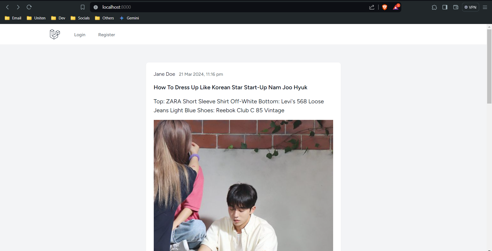
_Public/guest/visitor page_

### 3.2 Authentication

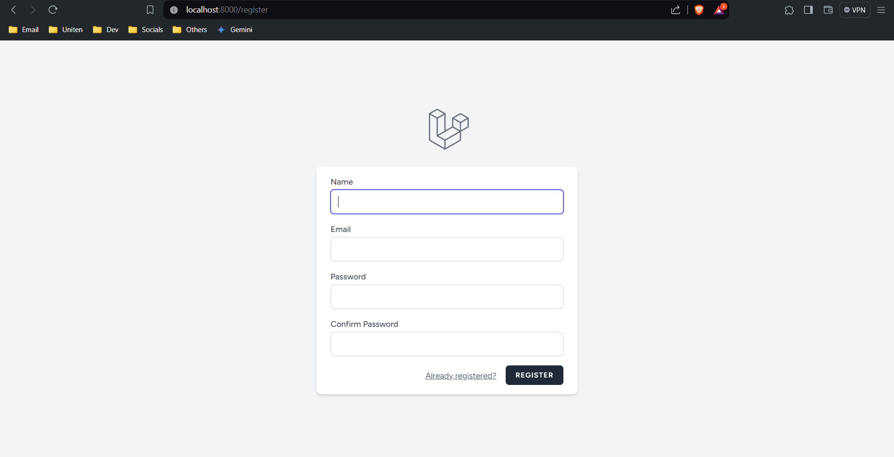
_Registration page_
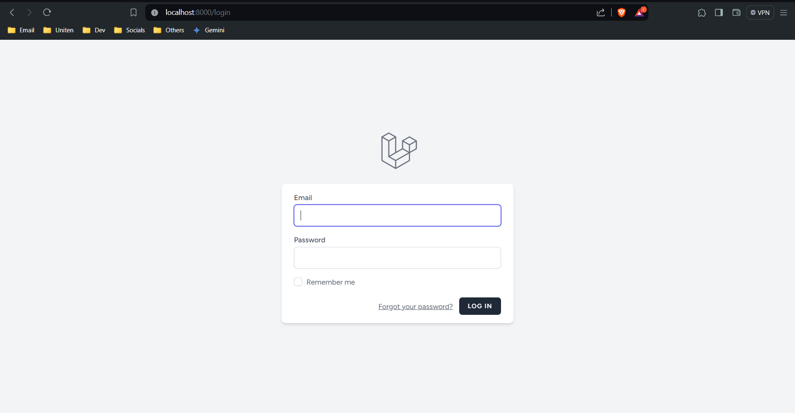
_Login page_
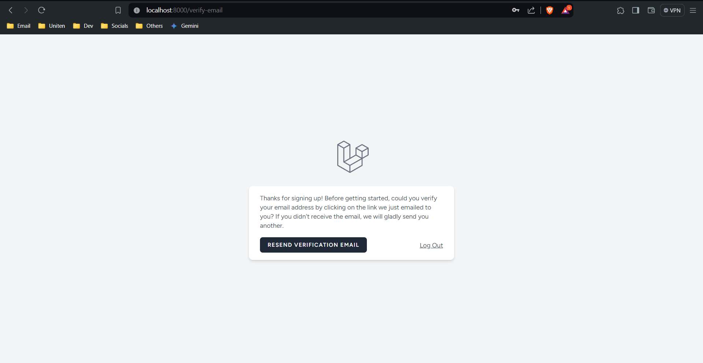
_Resend verify email_
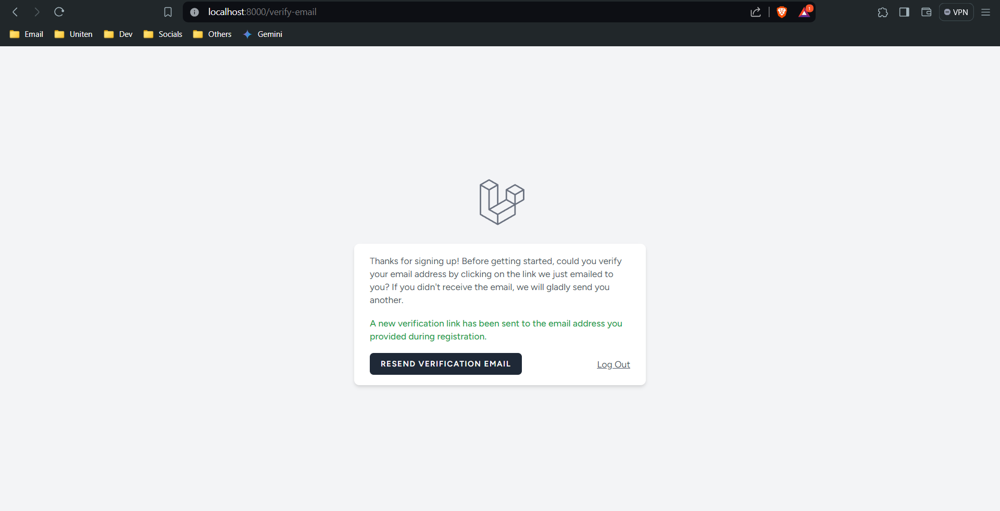
_Resend verify email (success)_
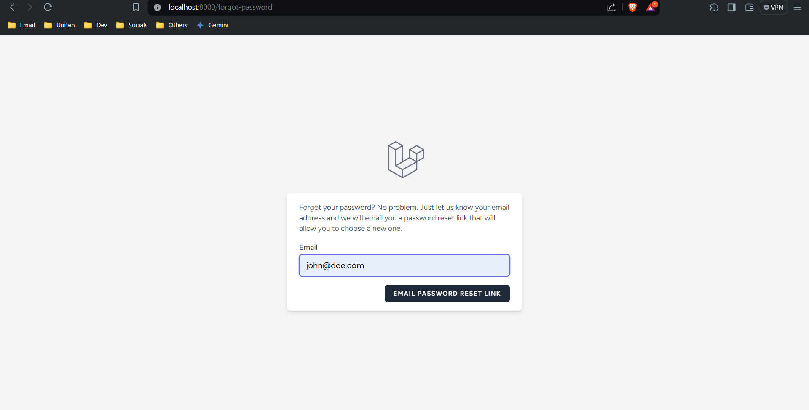
_Forgot password_
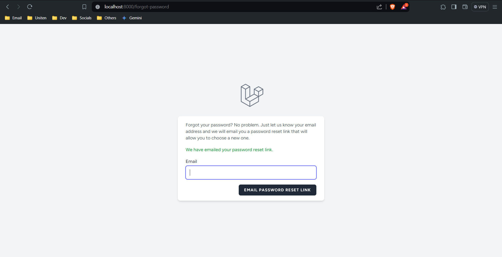
_Forgot password (success)_

### 3.3 Email

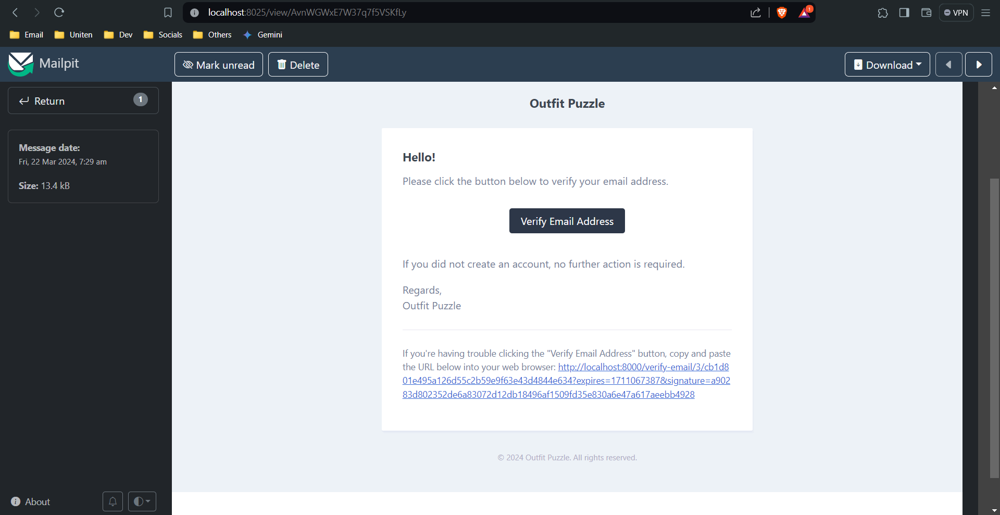
_Verify email template_
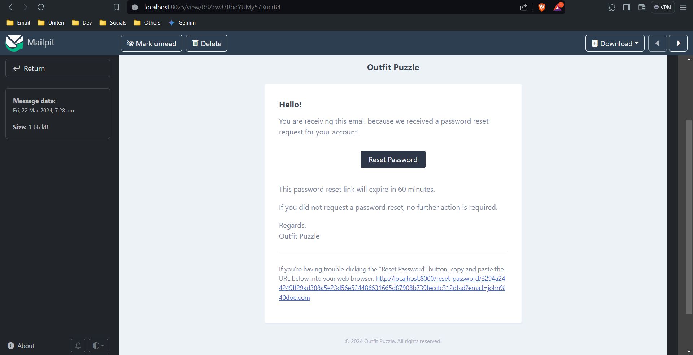
_Reset password email template_

### 3.4 Posts

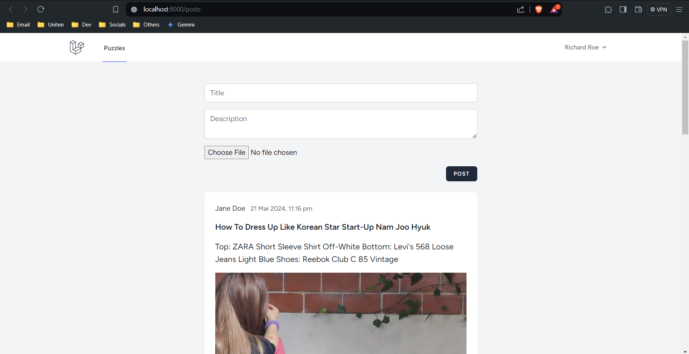
_Posts index page_
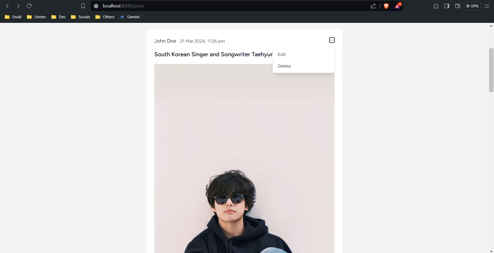
_Dropdown button_
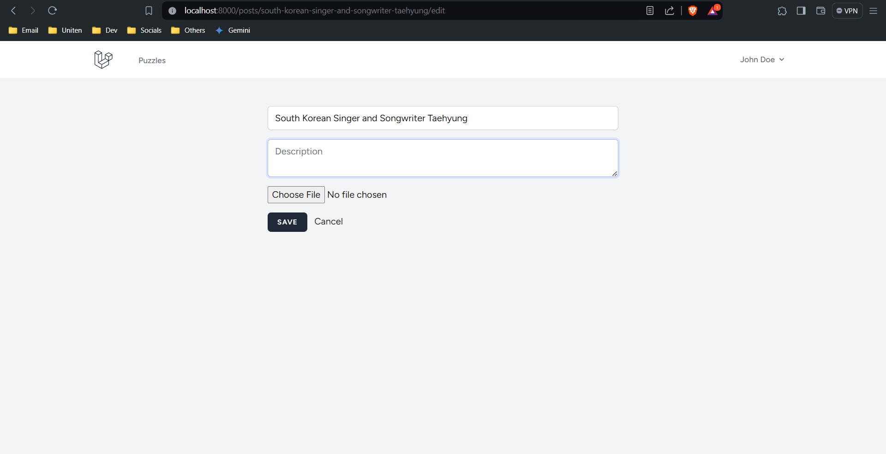
_Edit post page_

### 3.5 Profile

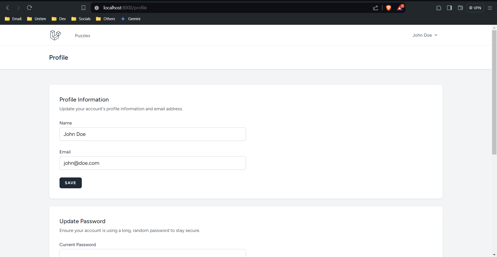
_Edit profile section_
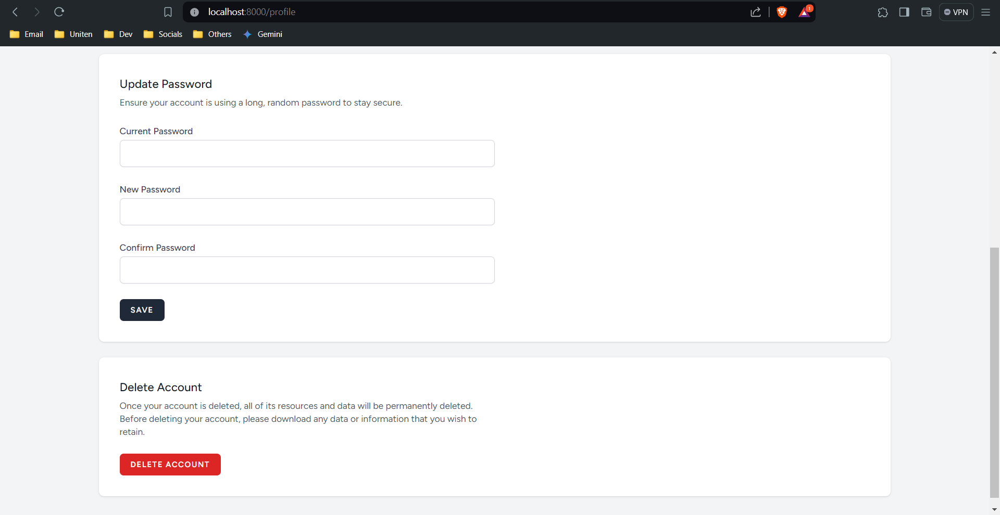
_Reset password section_  
_Delete profile section_

### 3.6 Admin
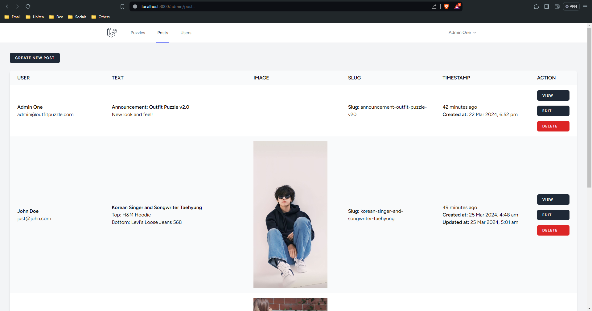
_Admin posts CRUD table_
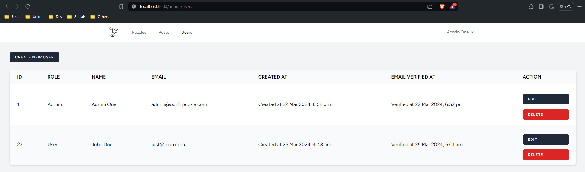
_Admin users CRUD table_

### 3.7 Database

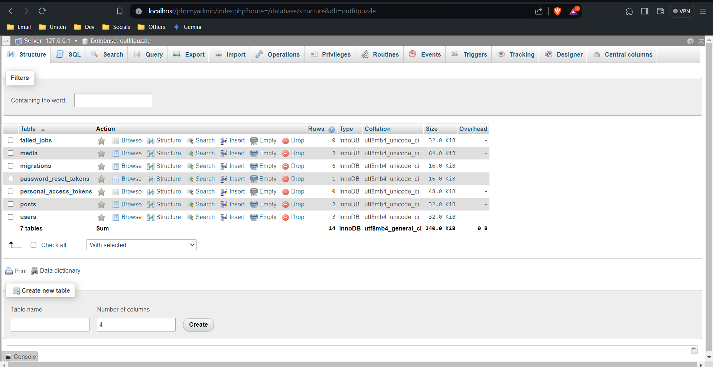
_App database structure_
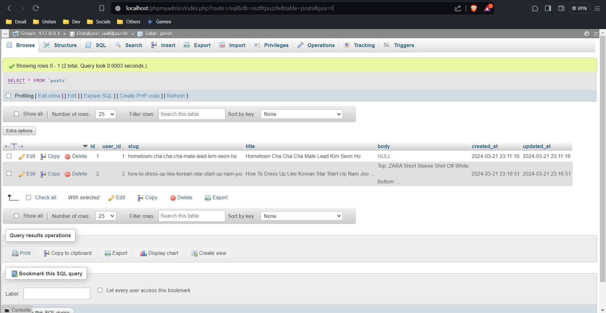
_Posts table structure_
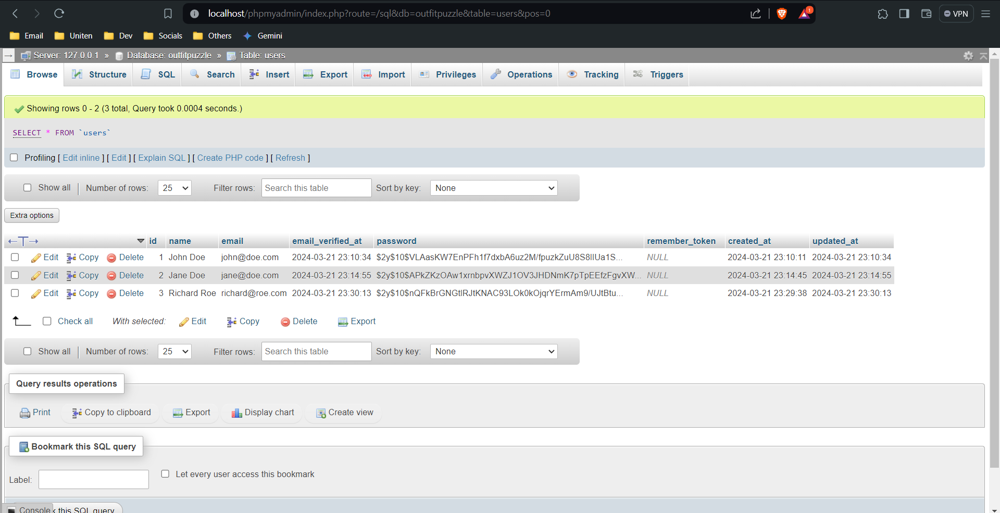
_Users table structure_
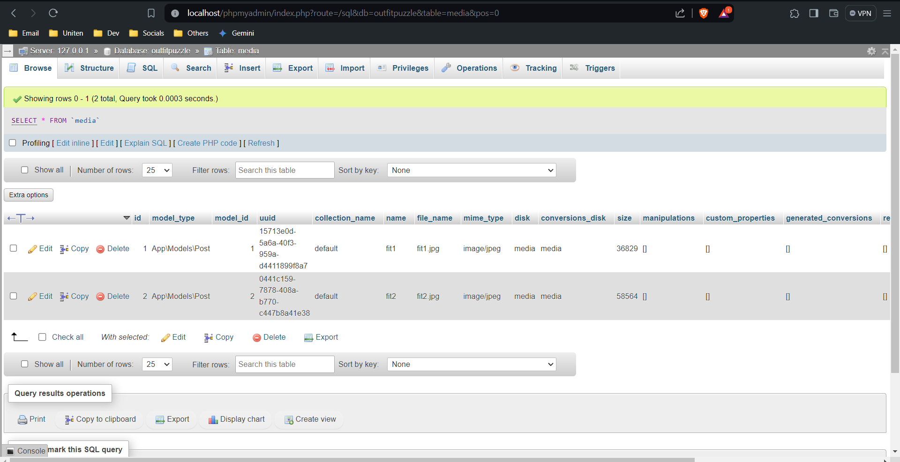
_Media table structure_
